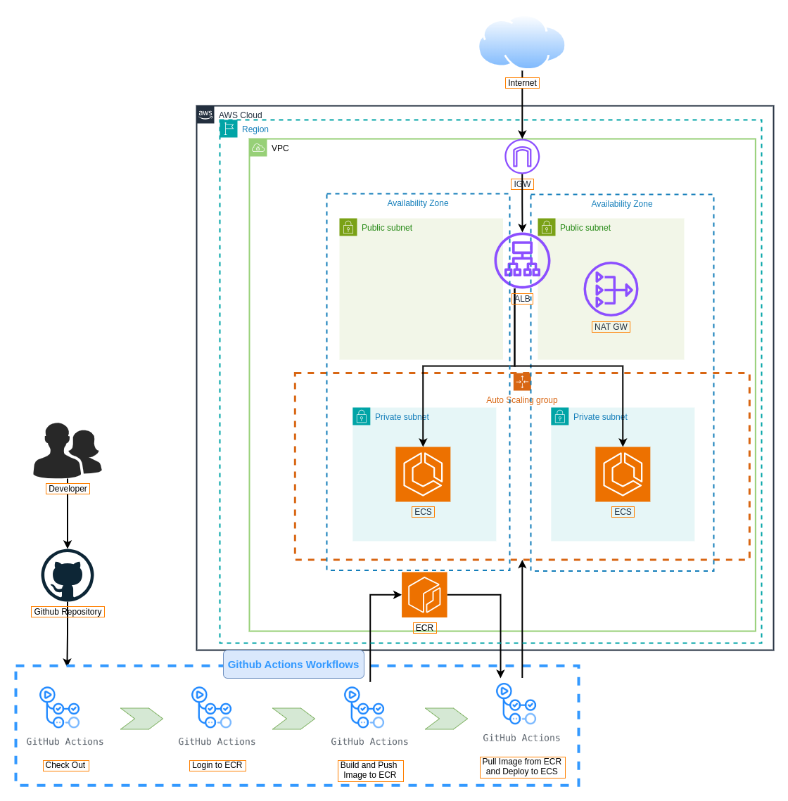

# Golden Owl DevOps Internship - Technical Test
At Golden Owl, we believe in treating infrastructure as code and automating resource provisioning to the fullest extent possible. 

In this technical test, we challenge you to create a robust CI build pipeline using GitHub Actions. You have the freedom to complete this test in your local environment.

## Your Mission 🌟
Your mission, should you choose to accept it, is to craft a CI job that:
1. Forks this repository to your personal GitHub account.
2. Dockerizes a Node.js application.
3. Establishes an automated CI/CD build process using GitHub Actions workflow and a container registry service such as DockerHub or Amazon Elastic Container Registry (ECR) or similar services.
4. Initiates CI tests automatically when changes are pushed to the feature branch on GitHub.
5. Utilizes GitHub Actions for Continuous Deployment (CD) to deploy the application to major cloud providers like AWS EC2, AWS ECS or Google Cloud (please submit the deployment link).
## Implementation steps
1. Visual workflow diagram:
   Deploy to ECS with launch type(FARGATE) combined with `load balancing` and `autoscaling`
   
2. Terraform: Infrastructure as Code
   
   You can  using the following command:
>>>>>>> b68f9f625d2e1cf693e79027382ef202196fbfce
```shell
# Navigate to the terraform directory
cd terraform

# Initialize Terraform in the current directory
terraform init

# Generate and show an execution plan
terraform plan --var-file "terraform.tfvars"

# Apply the changes required to reach the desired state
terraform apply --var-file "terraform.tfvars"

# Destroy the Terraform-managed infrastructure
terraform destroy --var-file "terraform.tfvars"        
```

3. Build CI/CD Pipeline
   - CI: Buil image and push to ECR
   - CD: Deploy to ECS with launch type(FARGATE)
4. Link DNS ALB: http://my-alb-2037840824.ap-southeast-1.elb.amazonaws.com
   
